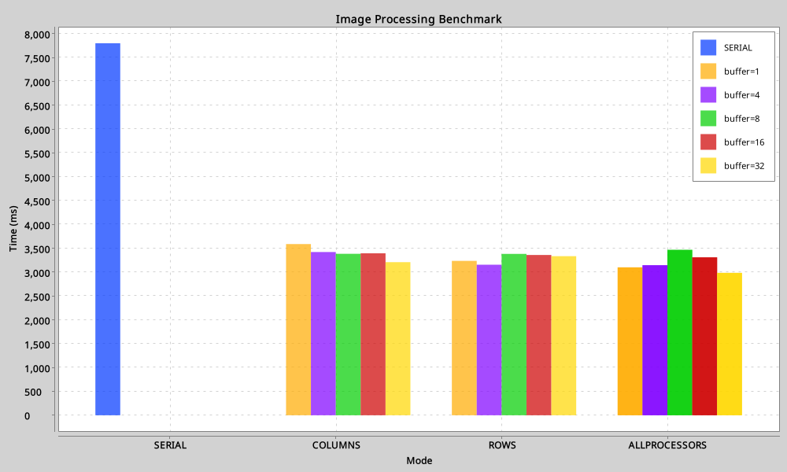

# Image Convolution

A command-line tool for applying 2D convolution filters to images or datasets. Supports multiple parallelization strategies and buffered pipelines for efficient image processing.

## Features

* Apply predefined filters (blur, sharpen, edge, etc.) to single images or directories.
* Multiple convolution strategies:

  * **SERIAL** – single-threaded processing
  * **PIXELWISE** – parallelized per pixel
  * **COLUMNS** – parallelized per image column
  * **ROWS** – parallelized per image row
  * **ALLPROCESSORS** – parallelized using all available CPU cores
* Configurable channel buffers for dataset pipelines to balance memory usage and processing speed.
* Outputs processed images and optional benchmarking CSV and chart.

## Installation

1. Clone the repository:

```bash
git clone https://github.com/shakareem/image-convolution.git
cd image-convolution
```

2. Build the project using Gradle:

```bash
./gradlew build
```

1. Run the tool via Gradle:

```bash
./gradlew run --args="..."
```

## Usage

### CLI Arguments

```text
-i, --input       Input file or directory (required)
-o, --output      Output file or directory (required)
-f, --filter      Filter name (required, available: blur, sharpen, edge, etc.)
-m, --mode        Convolution mode (SERIAL, PIXELWISE, COLUMNS, ROWS, ALLPROCESSORS, default ALLPROCESSORS)
-b, --buffer      Channel buffer size for dataset processing (optional, default 8)
```

### Examples

Apply a blur filter to a single image:

```bash
./gradlew run --args="-i input.bmp -o output.bmp -f blur -m ALLPROCESSORS"
```

Apply a sharpen filter to an entire directory with buffer size 16:

```bash
./gradlew run --args="-i images/ -o processed/ -f sharpen -m PIXELWISE -b 16"
```

## Benchmarking

The tool includes a benchmark script (`Benchmark.kt`) that measures the performance of different convolution modes with varying buffer sizes.
It outputs:

* `benchmark.csv` – average processing time per mode and buffer
* `benchmark.png` – bar chart visualizing the results
  
Running benchmark:
```bash
./gradlew benchmark
```

## Benchmark Results



> Note: Speedup depends on image size, number of images, and number of available CPU cores. Parallel strategies show most benefit on larger images.

## Dependencies

* Kotlin Standard Library
* kotlinx-coroutines
* XChart for benchmark plotting

## License

MIT License – see `LICENSE` file.

